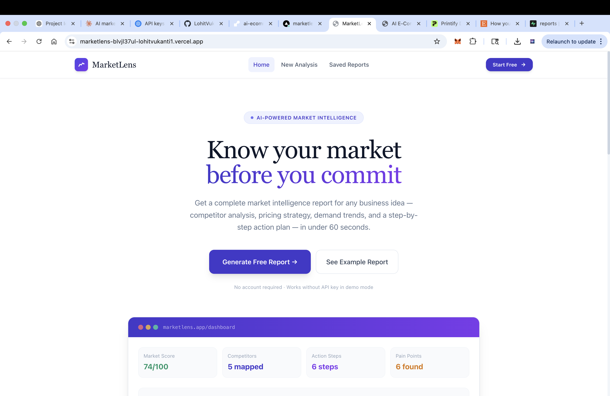
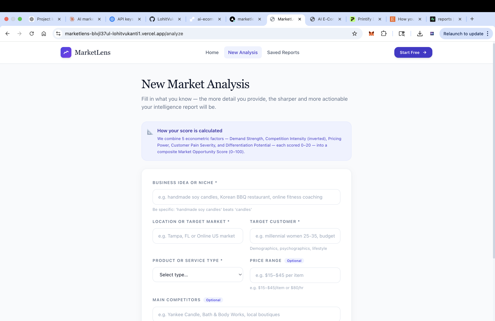
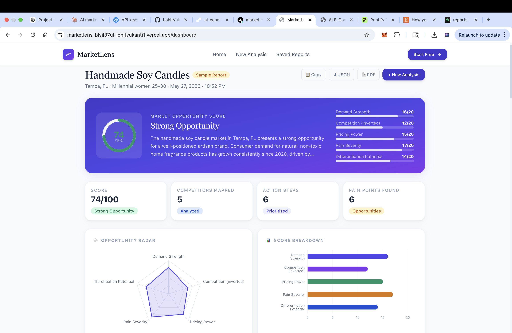
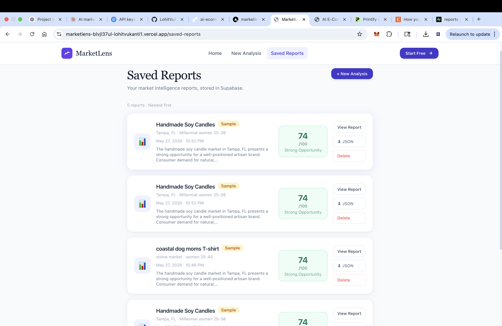

# MarketLens — AI Market Intelligence Platform

A full-stack MVP that generates AI-powered market intelligence reports for small businesses, Etsy sellers, restaurant owners, and local entrepreneurs.

Built with **Next.js 14 · TypeScript · Tailwind CSS · Anthropic Claude · Supabase · Recharts**.

---

## What It Does

Enter a business idea, location, and target customer → get a complete market intelligence report in under 60 seconds including:

- **Market Opportunity Score** (0–100) built from 5 econometric sub-factors
- Target customer profile & psychographics
- Competitor positioning table
- Pricing strategy with specific price points
- Customer pain points
- Demand trend analysis
- Differentiation strategy
- Marketing channel recommendations
- Risk assessment
- 6-step action plan
- Export as JSON, PDF, or copy to clipboard

---
---

## Screenshots

### Landing Page



### Analysis Form



### Dashboard



### Saved Reports



---

## Project Structure

```
marketlens/
├── src/
│   ├── app/
│   │   ├── api/
│   │   │   ├── generate-report/route.ts   ← Secure AI backend route
│   │   │   └── reports/
│   │   │       ├── route.ts               ← GET all saved reports
│   │   │       └── [id]/route.ts          ← DELETE a report
│   │   ├── analyze/page.tsx               ← New Analysis form page
│   │   ├── dashboard/page.tsx             ← Report dashboard page
│   │   ├── saved-reports/page.tsx         ← Saved reports list
│   │   ├── layout.tsx                     ← Root layout + fonts
│   │   ├── page.tsx                       ← Landing page
│   │   └── globals.css
│   ├── components/
│   │   ├── charts/OpportunityCharts.tsx   ← Recharts visualizations
│   │   ├── layout/Navbar.tsx
│   │   └── ui/
│   │       ├── index.tsx                  ← Shared UI primitives
│   │       └── ReportDashboard.tsx        ← Full dashboard component
│   ├── lib/
│   │   ├── ai-prompt.ts                   ← Prompt builder & response parser
│   │   ├── mock-data.ts                   ← Sample report for demo mode
│   │   ├── supabase.ts                    ← Supabase client instances
│   │   └── utils.ts                       ← Utilities: export, format, etc.
│   └── types/index.ts                     ← All TypeScript types
├── scripts/
│   ├── seed.ts                            ← Seed Supabase with sample data
│   └── supabase-schema.sql               ← Run in Supabase SQL editor
├── .env.example                           ← Copy to .env.local
├── next.config.js
├── tailwind.config.ts
└── tsconfig.json
```

---

## Quick Start (Local Development)

### 1. Clone and install

```bash
git clone https://github.com/your-username/marketlens.git
cd marketlens
npm install
```

### 2. Set up environment variables

```bash
cp .env.example .env.local
```

Edit `.env.local`:

```env
# Required for AI generation
ANTHROPIC_API_KEY=sk-ant-...

# Required for saving reports
NEXT_PUBLIC_SUPABASE_URL=https://your-project.supabase.co
NEXT_PUBLIC_SUPABASE_ANON_KEY=eyJhbGci...
SUPABASE_SERVICE_ROLE_KEY=eyJhbGci...

# Optional — set to true to skip AI calls entirely
NEXT_PUBLIC_MOCK_MODE=false
```

### 3. Set up Supabase

1. Create a free project at [supabase.com](https://supabase.com)
2. Go to **SQL Editor** in your Supabase dashboard
3. Paste and run the contents of `scripts/supabase-schema.sql`
4. Copy your project URL and keys from **Settings → API**

### 4. Run locally

```bash
npm run dev
```

Open [http://localhost:3000](http://localhost:3000).

### 5. (Optional) Seed sample data

```bash
npx ts-node --project tsconfig.json scripts/seed.ts
```

---

## Running Without API Keys (Demo Mode)

The app works **completely without any API keys** using mock mode:

- Click **"Use mock data"** on the analysis form, OR
- Set `NEXT_PUBLIC_MOCK_MODE=true` in `.env.local`, OR
- Visit `http://localhost:3000/analyze?mock=true`

This loads a fully rendered sample report (handmade soy candle business in Tampa, FL).

---

## Phase 1 Signal Engine

MarketLens now has a real trend signal path for `/feed`:

- `trend_signals` stores the latest product opportunity signals.
- `signal_history` stores each collector snapshot.
- `collection_jobs` records collector runs and fallback reasons.
- `/feed` reads Supabase first and falls back to the original mock feed only when Supabase is not configured, the query fails, or there are no rows.

### Required env vars

The report generator still uses the AI env vars above. The signal collector requires:

```env
NEXT_PUBLIC_SUPABASE_URL=https://your-project.supabase.co
NEXT_PUBLIC_SUPABASE_ANON_KEY=your_supabase_anon_key_here
SUPABASE_SERVICE_ROLE_KEY=your_supabase_service_role_key_here
```

Do not expose `SUPABASE_SERVICE_ROLE_KEY` in the browser. It is only used by server-side code and local scripts.

### Create the Supabase tables

Run the full contents of `scripts/supabase-schema.sql` in the Supabase SQL Editor. It preserves the existing `reports` table setup and adds:

- `trend_signals`
- `signal_history`
- `collection_jobs`
- `watchlist_items`

### Phase 2 Watchlists and Alert Thresholds

`watchlist_items` stores persistent anonymous watchlists for the retention MVP:

- `session_id` is generated in the browser and saved to `localStorage` under `marketlens_session_id`.
- The app sends that `session_id` with watchlist reads/writes and filters Supabase queries by it.
- No login is required yet. This is suitable for the public MVP, but it is not an auth boundary.
- RLS is enabled with public MVP policies that allow anon reads/writes when a non-empty `session_id` is present. Replace these with `auth.uid()` policies when full auth ships.

Watchlist SQL is included in `scripts/supabase-schema.sql` for fresh projects and `scripts/phase-2-watchlist-items.sql` for existing Phase 1 projects. If your Supabase project already has the Phase 1 tables, run:

```sql
create table if not exists public.watchlist_items (
  id                uuid primary key default gen_random_uuid(),
  session_id        text not null check (length(trim(session_id)) > 0),
  signal_id         text not null references public.trend_signals(id) on delete cascade,
  alert_threshold   integer not null default 80 check (alert_threshold between 0 and 100),
  created_at        timestamptz not null default now(),
  last_alerted_at   timestamptz,
  unique (session_id, signal_id)
);

create index if not exists watchlist_items_session_created_idx
  on public.watchlist_items (session_id, created_at desc);

create index if not exists watchlist_items_signal_idx
  on public.watchlist_items (signal_id);

create index if not exists watchlist_items_threshold_idx
  on public.watchlist_items (alert_threshold);

alter table public.watchlist_items enable row level security;

create policy "Public read watchlist items by session id"
  on public.watchlist_items for select
  using (true);

create policy "Public insert watchlist items with session id"
  on public.watchlist_items for insert
  with check (length(trim(session_id)) > 0);

create policy "Public update watchlist items with session id"
  on public.watchlist_items for update
  using (length(trim(session_id)) > 0)
  with check (length(trim(session_id)) > 0);

create policy "Public delete watchlist items with session id"
  on public.watchlist_items for delete
  using (length(trim(session_id)) > 0);
```

Manual watchlist test:

1. Run the SQL schema and confirm `trend_signals` has rows.
2. Start the app with `npm run dev`.
3. Open `/feed` and click `Add to Watchlist` on a signal.
4. Confirm the button changes to `Watching`.
5. Open `/watchlist` and confirm the same signal appears from Supabase.
6. Change the alert threshold below the signal score and confirm `Threshold triggered` appears.
7. Raise the threshold above the signal score and confirm only non-threshold badges remain.
8. Open `/briefing`; it should say `Watchlist` when watched items exist.
9. Remove all watched items and reload `/briefing`; it should use the global feed or mock fallback.

### Run or seed signals

```bash
npm run signals:update
```

This command tries to collect US Google Trends data through local Python `pytrends`. If `pytrends`, Python, network access, or Google Trends fails, the script upserts deterministic fallback seed signals so the platform remains demo-safe.

Optional local Google Trends dependency:

```bash
python3 -m pip install pytrends
```

`npm run seed:signals` is an alias for the same safe collector.

### Verify `/feed` is using real data

1. Run the SQL schema in Supabase.
2. Confirm `.env.local` has the three Supabase variables above.
3. Run `npm run signals:update`.
4. Start the app with `npm run dev`.
5. Open `/feed` and look for the source label in the filter bar:
   - `Supabase live` means rows came from `trend_signals`.
   - `Mock fallback` means Supabase returned no usable signal rows.

### Deploy on Vercel safely

No scheduled jobs are required for Phase 1. Add the same Supabase env vars in Vercel and deploy normally. The app will read `trend_signals` at request time. Run `npm run signals:update` locally whenever you want to refresh signals, or later move that command into a scheduled job in Phase 2.

Do not run the Python collector inside the Next.js request path; it belongs in `/scripts` so Vercel builds and page requests stay stable.

---

## Deployment (Vercel — Recommended)

### 1. Push to GitHub

```bash
git init
git add .
git commit -m "Initial MarketLens MVP"
git remote add origin https://github.com/your-username/marketlens.git
git push -u origin main
```

### 2. Deploy to Vercel

1. Go to [vercel.com](https://vercel.com) → **New Project**
2. Import your GitHub repo
3. Add all environment variables from `.env.example` in the Vercel dashboard
4. Click **Deploy**

Your app will be live at `https://your-project.vercel.app`.

### 3. Update Supabase CORS

In your Supabase dashboard → **Settings → API → CORS Allowed Origins**, add your Vercel URL:

```
https://marketlens-blvjl37ul-lohitvukanti1.vercel.app/
```

---

## Environment Variables Reference

| Variable | Required | Description |
|---|---|---|
| `ANTHROPIC_API_KEY` | Yes (for AI) | Anthropic Claude API key |
| `AI_PROVIDER` | No | `anthropic` (default) |
| `NEXT_PUBLIC_MOCK_MODE` | No | `true` to skip AI calls |
| `NEXT_PUBLIC_SUPABASE_URL` | Yes (for DB) | Your Supabase project URL |
| `NEXT_PUBLIC_SUPABASE_ANON_KEY` | Yes (for DB) | Supabase anon key |
| `SUPABASE_SERVICE_ROLE_KEY` | Yes (for DB writes) | Supabase service role key |
| `NEXT_PUBLIC_APP_URL` | No | App URL (for OG tags) |

---

## Scoring Methodology

The **Market Opportunity Score (0–100)** is a composite index of 5 equally-weighted factors, each scored 0–20:

| Factor | Description |
|---|---|
| **Demand Strength** | Estimated market size, search trend trajectory, and purchase frequency signals |
| **Competition (inverted)** | Higher score = less entrenched competition. Assessed by number of competitors, their resource levels, and market saturation |
| **Pricing Power** | Ability to command premium pricing based on product differentiation, customer willingness to pay, and perceived value |
| **Pain Severity** | How acute and underserved the target customer's problems are — a proxy for organic demand pull |
| **Differentiation Potential** | How many viable differentiation vectors exist (local identity, customization, subscription, etc.) |

This approach mirrors index construction methods from applied econometrics (weighted factor models), making it explainable and auditable rather than a black-box AI score.

---

## Tech Stack

| Layer | Technology |
|---|---|
| Frontend | Next.js 14 (App Router), TypeScript |
| Styling | Tailwind CSS, DM Sans + DM Serif Display |
| Charts | Recharts |
| AI | Anthropic Claude (claude-sonnet-4) via secure API route |
| Database | Supabase (PostgreSQL + JSONB) |
| PDF Export | jsPDF |
| Deployment | Vercel |

---

## Monetization Roadmap (Post-MVP)

- **Freemium**: 3 free reports/month, unlimited on Pro ($19/mo)
- **API access**: Programmatic report generation for agencies and tools
- **White-label**: Branded reports for business consultants
- **Industry verticals**: Pre-built report templates for restaurants, Etsy, SaaS
- **AI follow-up chat**: Ask follow-up questions on your report

---

## Contributing

PRs welcome! Please open an issue first to discuss major changes.

---

## License

MIT © MarketLens
